```mermaid
flowchart LR
    SFPROJ[".sfproj file"] -->|"dotnet build"| COMPILE["Compile<br/>service projects"]
    COMPILE --> BIN["bin/Debug/<br/>compiled binaries"]
    BIN -..->|"❌ Missing"| PKG["SF package<br/>structure"]

    style PKG fill:#5a2727,color:#fff,stroke-dasharray: 5 5
```

# Service Fabric Build → Package → Deploy Flow

> **Status:** Active analysis — Feb 2026  
> **Scope:** How the extension builds `.sfproj` applications, assembles the SF application package, and deploys to a cluster  
> **Related:** [deploy-upgrade-phases.md](deploy-upgrade-phases.md) · [SF_APPLICATION_CRUD_LIFECYCLE.md](SF_APPLICATION_CRUD_LIFECYCLE.md)

---

## Table of Contents

- [Overview](#overview)
- [SF Application Package Spec](#sf-application-package-spec)
- [Build Methods](#build-methods)
- [End-to-End Flow](#end-to-end-flow)
- [Code Path Walkthrough](#code-path-walkthrough)
- [findPackagePath — Package Discovery](#findpackagepath--package-discovery)
- [Image Store Upload Architecture](#image-store-upload-architecture)
- [Known Issues & Gaps](#known-issues--gaps)
- [Settings](#settings)
- [Troubleshooting](#troubleshooting)

---

## Overview

The extension supports building, packaging, and deploying Service Fabric applications from VS Code. The process has three distinct stages:

```mermaid
flowchart LR
    subgraph "Stage 1: Build"
        BUILD["Compile service code<br/><code>dotnet build</code> or<br/><code>msbuild</code>"]
    end
    subgraph "Stage 2: Package"
        PKG["Assemble SF package<br/>directory structure<br/><code>msbuild /t:Package</code>"]
    end
    subgraph "Stage 3: Deploy"
        DEPLOY["Upload → Provision → Create<br/>via REST API or PowerShell"]
    end

    BUILD --> PKG --> DEPLOY

    style BUILD fill:#264f78,color:#fff
    style PKG fill:#4a6741,color:#fff
    style DEPLOY fill:#6b4c8a,color:#fff
```



> **Key insight:** Building code and packaging an SF application are **separate concerns**. `dotnet build` compiles code. `msbuild /t:Package` compiles _and_ assembles the package. This distinction is the root cause of "cannot find package" errors.

---

## SF Application Package Spec

Service Fabric requires a specific directory layout for the application package that gets uploaded to the Image Store. This spec is non-negotiable — the cluster's Image Builder service rejects packages that don't conform.

### Required Structure

```
<ApplicationTypeName>/
│
├── ApplicationManifest.xml          ← Root manifest (REQUIRED)
│
├── <ServiceManifestName1>/          ← One folder per ServiceManifestImport
│   ├── ServiceManifest.xml          ← Service manifest (REQUIRED)
│   ├── Code/                        ← Code package (REQUIRED)
│   │   ├── MyService.dll
│   │   ├── MyService.exe
│   │   └── ...                      ← All service binaries
│   ├── Config/                      ← Config package (REQUIRED if declared)
│   │   └── Settings.xml
│   └── Data/                        ← Data package (optional)
│       └── ...
│
├── <ServiceManifestName2>/
│   ├── ServiceManifest.xml
│   ├── Code/
│   │   └── ...
│   └── Config/
│       └── Settings.xml
│
└── ... (additional services)
```

### Validation Rules

| Rule | Enforcement |
|------|-------------|
| `ApplicationManifest.xml` must exist at package root | Checked by `SfDeployService.deployToCluster()` before upload |
| Each `ServiceManifestImport` → matching subfolder | Validated by cluster's Image Builder during provision |
| `ServiceManifest.xml` in each service subfolder | Validated by cluster's Image Builder during provision |
| `Code/` subfolder must contain entry point binary | Validated by cluster at service activation |
| Version attributes must match between manifests | Validated by cluster's Image Builder during provision |
| All `<Parameter>` references must be declared | Filtered by `SfDeployService.filterParameters()` |

### Manifest Relationship


---

## Build Methods

The extension supports two build methods, configurable via the `sfClusterExplorer.buildMethod` setting. **The default is `msbuild`**, which automatically falls back to `dotnet msbuild` if standalone MSBuild is not available.

### `msbuild` — MSBuild with SF SDK Targets (Default)

**Resolution order:**
1. Try standalone `msbuild` (Visual Studio / Build Tools) — `msbuild -version`
2. Fallback to `dotnet msbuild` (.NET SDK) — `dotnet msbuild -version`
3. If neither found, show download links

```
msbuild "MyApp.sfproj" /t:Package /p:Configuration=Debug
# OR (automatically used as fallback)
dotnet msbuild "MyApp.sfproj" /t:Package /p:Configuration=Debug
```

**Why `dotnet msbuild` is the fallback:**
- `dotnet msbuild` ships with the .NET SDK (single download, no additional dependencies)
- Supports the same MSBuild targets/tasks as standalone MSBuild
- Provides `/t:Package` target via `Microsoft.VisualStudio.Azure.Fabric.MSBuild` NuGet
- More widely available than Visual Studio Build Tools (especially on dev machines without VS)
- Works identically for SF application packaging

```mermaid
flowchart LR
    SFPROJ[".sfproj file"] -->|"imports"| TARGETS["Microsoft.VisualStudio.Azure<br/>.Fabric.MSBuild.targets<br/>(NuGet package)"]
    TARGETS -->|"/t:Package"| BUILD_SVC["Build each<br/>service .csproj"]
    BUILD_SVC --> ASSEMBLE["Assemble SF package<br/>in pkg/Debug/"]
    ASSEMBLE --> PKG["✅ Complete SF package<br/>with correct structure"]

    style TARGETS fill:#8b6914,color:#fff
    style PKG fill:#2d5a27,color:#fff
```



| Aspect | Details |
|--------|---------|
| **What it does** | Compiles all service projects AND assembles the SF package layout |
| **Output location** | `{projectDir}/pkg/Debug/` (or Release) |
| **Output contents** | Full SF package: `ApplicationManifest.xml` + service subfolders with `ServiceManifest.xml`, `Code/`, `Config/` |
| **Prerequisites** | MSBuild on PATH (standalone or via .NET SDK) + `Microsoft.VisualStudio.Azure.Fabric.MSBuild` NuGet package |
| **Produces valid SF package?** | ✅ **Yes** — the `/t:Package` target is purpose-built for this |
| **Pre-flight check** | Extension automatically checks for `msbuild` / `dotnet msbuild` availability before build |

### `dotnet` — dotnet CLI Build

```
dotnet build "MyApp.sfproj" --configuration Debug
```



| Aspect | Details |
|--------|---------|
| **What it does** | Compiles the project (may build referenced `.csproj` files) |
| **Output location** | `{projectDir}/` (returned as `outputPath` — not a package) |
| **Output contents** | Compiled binaries only — **no SF package layout** |
| **Prerequisites** | .NET SDK on PATH |
| **Produces valid SF package?** | ❌ **No** — `dotnet build` doesn't invoke the `/t:Package` target |

> ⚠️ **This is the primary gap.** `dotnet build` on an `.sfproj` compiles code but does not produce the directory structure SF requires. The deploy step then fails to find the package.

### Comparison Matrix

| Capability | `msbuild /t:Package` | `dotnet build` |
|------------|---------------------|----------------|
| Compiles service code | ✅ | ✅ |
| Creates `ApplicationManifest.xml` at pkg root | ✅ | ❌ |
| Creates service subfolders | ✅ | ❌ |
| Copies `ServiceManifest.xml` per service | ✅ | ❌ |
| Copies `Code/` binaries per service | ✅ | ❌ |
| Copies `Config/Settings.xml` per service | ✅ | ❌ |
| Output found by `findPackagePath()` | ✅ `pkg/Debug/` | ❌ No matching candidate |
| Requires SF MSBuild targets NuGet | ✅ | N/A |
| Works cross-platform (Linux/macOS) | ⚠️ (Works if .NET SDK provides MSBuild on that platform) | ✅ |
| Pre-flight validation | ✅ Checks msbuild/dotnet msbuild availability | ✅ Checks dotnet availability |

---

## End-to-End Flow

### Complete Build → Package → Deploy Pipeline

```mermaid
flowchart TD
    CMD["User: <b>sfApplications.buildProject</b>"]
    CMD --> RESOLVE["resolveBuildMethod()<br/>Read <code>sfClusterExplorer.buildMethod</code> setting"]
    
    RESOLVE -->|"dotnet"| DOTNET["buildWithDotnet()<br/><code>dotnet build MyApp.sfproj</code>"]
    RESOLVE -->|"msbuild (default)"| PREFLIGHT["Pre-flight: Check for<br/>msbuild or dotnet msbuild"]
    PREFLIGHT -->|"Found"| MSBUILD["buildWithMsBuild()<br/><code>msbuild MyApp.sfproj /t:Package</code><br/>OR <code>dotnet msbuild MyApp.sfproj /t:Package</code>"]
    PREFLIGHT -->|"Not found"| DOWNLOAD["Show download links:<br/>.NET SDK (dotnet msbuild)<br/>VS Build Tools (msbuild)"]
    RESOLVE -->|"ask"| PICKER["Show QuickPick<br/>dotnet / MSBuild"]
    PICKER --> DOTNET
    PICKER --> MSBUILD
    
    DOTNET -->|"Terminal (async)"| DOTNET_OUT["Output: compiled binaries<br/>⚠️ No SF package structure"]
    MSBUILD -->|"Terminal (async)"| MSBUILD_OUT["Output: pkg/Debug/<br/>✅ Valid SF package"]

    DOTNET_OUT -..->|"User triggers deploy"| FIND_PKG
    MSBUILD_OUT -->|"User triggers deploy"| FIND_PKG

    FIND_PKG["findPackagePath()<br/>Search candidate dirs<br/>for ApplicationManifest.xml"]
    
    FIND_PKG -->|"Found"| DEPLOY
    FIND_PKG -->|"Not found"| PROMPT_BUILD["⚠️ 'No packaged output found.<br/>Build first?'"]
    PROMPT_BUILD -->|"Build"| CMD

    subgraph deploy ["Deploy to Cluster"]
        DEPLOY["deployToCluster()"] --> PREFLIGHT2["Pre-flight Check"]
        PREFLIGHT2 --> UPLOAD["Upload to Image Store<br/>Parallel PUT (8 concurrent workers)"]
        UPLOAD --> MARKERS["Upload _.dir markers<br/>(fabric:ImageStore only, parallel)"]
        MARKERS --> VERIFY["Verify Upload"]
        VERIFY --> PROVISION["Provision Application Type"]
        PROVISION --> POLL["Poll until Available"]
        POLL --> CREATE["Create Application Instance"]
    end

    CREATE --> DONE(["✅ Deployed"])

    style DOTNET_OUT fill:#5a4a27,color:#fff
    style MSBUILD_OUT fill:#2d5a27,color:#fff
    style PROMPT_BUILD fill:#5a4a27,color:#fff
    style DONE fill:#2d5a27,color:#fff
```



### Sequence Diagram — Build + Deploy

```mermaid
sequenceDiagram
    actor User
    participant PC as ProjectCommands
    participant DS as SfDeployService
    participant Term as VS Code Terminal
    participant IS as Image Store (REST)
    participant Cluster as SF Cluster (REST)

    User->>PC: sfApplications.buildProject
    PC->>PC: resolveBuildMethod() → read setting (default: msbuild)
    alt method = msbuild
        PC->>DS: Pre-flight: resolveMsBuildCommand()
        DS->>DS: Try msbuild -version
        DS->>DS: Try dotnet msbuild -version
        alt MSBuild available
            DS-->>PC: "msbuild" or "dotnet msbuild"
        else MSBuild not found
            DS-->>PC: undefined
            PC-->>User: Show download links
        end
    end
    PC->>DS: buildProject(project, method)
    DS->>Term: createTerminal()
    DS->>Term: sendText("dotnet build" or "msbuild /t:Package" or "dotnet msbuild /t:Package")
    Term-->>User: Build output visible in terminal
    DS-->>PC: BuildResult { success: true, optimistic }
    PC-->>User: "Build launched. Check terminal."

    Note over User,Term: ⏳ User waits for terminal build to finish

    User->>PC: sfApplications.deployProject
    PC->>DS: findPackagePath(project)
    
    alt Package found (msbuild produced pkg/Debug/)
        DS-->>PC: packagePath
        PC->>DS: deployToCluster(sfRest, options, packagePath)
        DS->>DS: Validate: ApplicationManifest.xml exists?
        DS->>Cluster: Pre-flight: GET /ApplicationTypes
        DS->>IS: Upload: parallel PUT /ImageStore/{path} (8 concurrent workers)
        IS-->>DS: 200 OK (each file)
        DS->>IS: Upload: PUT /ImageStore/{path}/_.dir (markers, parallel)
        DS->>IS: Verify: GET /ImageStore/{path}
        DS->>Cluster: POST /ApplicationTypes/$/Provision
        loop Poll until Available
            DS->>Cluster: GET /ApplicationTypes/{name}
        end
        DS->>Cluster: POST /Applications/$/Create
        Cluster-->>DS: 201 Created
        DS-->>User: ✅ "Successfully deployed"
    else Package NOT found (dotnet build didn't produce package)
        DS-->>PC: undefined
        PC-->>User: ⚠️ "No packaged output found. Build first?"
    end
```



---

## Code Path Walkthrough

### Entry Point: `ProjectCommands.ts`

```
sfApplications.buildProject (command)
    ├── No tree node → discoverProjects() → QuickPick → resolveBuildMethod()
    └── Tree node clicked → resolveBuildMethod()
            │
            ├── Setting = "dotnet"  → deployService.buildProject(project, "dotnet")
            ├── Setting = "msbuild" → deployService.buildProject(project, "msbuild")
            └── Setting = "ask"     → QuickPick → deployService.buildProject(project, choice)
```

### Build Dispatch: `SfDeployService.ts`

```
buildProject(project, method)
    ├── "msbuild" → buildWithMsBuild(project)
    │                  └── Terminal: msbuild "{sfprojPath}" /t:Package /p:Configuration=Debug
    │                  └── Returns: { outputPath: "pkg/Debug" }
    │
    └── "dotnet"  → buildWithDotnet(project)
                       └── Terminal: dotnet build "{sfprojPath}" --configuration Debug
                       └── Returns: { outputPath: projectDir }  ← ⚠️ Not a package
```

### Package Discovery: `SfDeployService.findPackagePath()`

```
findPackagePath(project, configuration="Debug")
    Search order:
    1. {projectDir}/pkg/{configuration}         ← MSBuild /t:Package output
    2. {projectDir}/pkg/Release
    3. {projectDir}/pkg/Debug
    4. {projectDir}/bin/{config}/netcoreapp3.1/publish
    5. {projectDir}/bin/{config}/net6.0/publish
    6. {projectDir}/bin/{config}/net8.0/publish

    Validation: directory exists AND contains ApplicationManifest.xml
```

---

## findPackagePath — Package Discovery

The `findPackagePath` method is the bridge between build and deploy. It searches for a valid SF package by iterating candidate paths and checking for `ApplicationManifest.xml`:


> Note: The `bin/*/publish` candidates only work if someone manually assembled an SF package there. Normal `dotnet publish` output does NOT contain `ApplicationManifest.xml`.

---

## Image Store Upload Architecture

The upload phase is performance-critical for large SF application packages (which can contain hundreds of files). This section documents how the native SF client handles uploads and how the extension mirrors that behavior.

### Native SF Client Approach (WindowsFabric Source)

The official Service Fabric client (used by `Copy-ServiceFabricApplicationPackage` PowerShell cmdlet, sfctl, and the C# SDK) uploads ALL files **in parallel**. The call chain is:

```
Copy-ServiceFabricApplicationPackage (PowerShell cmdlet)
  -> CommonCmdletBase.UploadToImageStore()
    -> ImageStoreFactory.CreateImageStore() -> IImageStore
    -> imageStore.UploadContent(dest, src, progressHandler, timeout, CopyFlag.AtomicCopy)
      -> NativeImageStoreClient.UploadContentWrapper()
        -> Native COM interop -> NativeImageStore.cpp
          -> ParallelUploadObjectsAsyncOperation
            -> Fires ALL file uploads concurrently as async operations
```

Key details from `NativeImageStore.cpp` (WindowsFabric native source):

| Aspect | Implementation |
|--------|----------------|
| **Parallelism** | `ParallelOperationsBaseAsyncOperation` fires ALL uploads simultaneously |
| **Pending tracking** | `pendingCount_.store(destinations_.size())` - atomic counter for all files |
| **Completion** | Each async operation decrements `pendingCount_`; complete when 0 |
| **No concurrency limit** | The native client fires all files at once (no batching) |
| **`_.dir` markers** | `DirectoryMarkerFileName = "_.dir"` confirmed in native code |

### HTTP Gateway Upload Support

The SF HTTP gateway (`imagestorehandler.cpp`) supports multiple upload modes:

| Mode | Endpoint | Use Case |
|------|----------|----------|
| **Single-file PUT** | `PUT /ImageStore/{path}` | Upload entire file in one request |
| **Chunked upload** | `PUT /ImageStore/{path}` with `Content-Range` header | Large files sent in chunks |
| **Upload session** | `UploadChunk` / `CommitUploadSession` | Resumable multi-chunk uploads |

The extension uses the single-file PUT approach with parallel requests, which matches the native client's effective behavior.

### Extension Upload Implementation

The extension's `sfRest.uploadApplicationPackage()` method uploads files **in parallel** with a concurrency cap of 8, matching the native SF client's parallel pattern while avoiding overwhelming the HTTP gateway:

1. **Collect files** - recursively enumerate all files in the package directory with sizes
2. **Parallel upload** - upload files concurrently via a worker pool (maxConcurrency=8, each worker pulls from a shared queue)
3. **Upload `_.dir` markers** - for `fabric:ImageStore` (service-based), upload 0-byte `_.dir` marker files in parallel (same concurrency cap)
4. **Progress reporting** - track completed files vs total for UI feedback
5. **Fail-fast** - on first error, all workers stop and the error propagates


> **Why capped at 8:** The native SF client (`NativeImageStore.cpp`) fires ALL uploads at once with no explicit limit, relying on the OS TCP stack to manage connections. For the extension's Node.js HTTP agent, 8 concurrent uploads provides a good balance between throughput and gateway/TLS stability. Each worker pulls from a shared queue until all files are uploaded or an error occurs.

---

## Known Issues & Gaps

### 🔴 Critical: `dotnet build` Does Not Produce SF Package

| Issue | Detail |
|-------|--------|
| **Symptom** | "No packaged output found" after building with dotnet |
| **Root cause** | `dotnet build` compiles code but doesn't invoke the SF packaging targets |
| **Why `.sfproj` is special** | `.sfproj` files import `Microsoft.VisualStudio.Azure.Fabric.MSBuild.targets` which defines the `/t:Package` target. `dotnet build` doesn't invoke this target. |
| **Impact** | Deploy fails after dotnet build; user gets stuck in build→"no package"→build loop |

**What needs to happen for dotnet build path to work:**

```mermaid
flowchart TD
    subgraph "Current (broken)"
        D1["dotnet build MyApp.sfproj"] --> D2["Compiled binaries<br/>in bin/"]
        D2 -..->|"❌ Gap"| D3["No SF package"]
    end

    subgraph "Required (assembler needed)"
        R1["dotnet publish per<br/>service .csproj"] --> R2["Published binaries"]
        R2 --> R3["Assembler: Create pkg/<br/>directory structure"]
        R3 --> R4["Copy ApplicationManifest.xml<br/>to pkg root"]
        R4 --> R5["Per service: create subfolder<br/>+ ServiceManifest.xml<br/>+ Code/ + Config/"]
        R5 --> R6["✅ Valid SF package"]
    end

    style D3 fill:#5a2727,color:#fff,stroke-dasharray: 5 5
    style R6 fill:#2d5a27,color:#fff
```



### ✅ Resolved: Parallel Image Store Upload (Feb 2026)

| Aspect | Detail |
|--------|--------|
| **Status** | ✅ **Fixed** — parallel upload implemented with concurrency cap of 8 |
| **Implementation** | `sfRest.uploadApplicationPackage()` uses worker-pool pattern: 8 workers pull from shared queue, each calls `uploadFileToImageStore()` |
| **HTTP Agent** | `keepAlive: true, maxSockets: 8, maxFreeSockets: 8` — reuses TCP+TLS connections across requests |
| **Connection Reuse** | Removed `Connection: close` header — agent maintains persistent connections to gateway |
| **Performance** | Verified 4.1x speedup on 5-node cluster (16 files: 3955ms sequential → 965ms parallel) |
| **Concurrency Cap** | 8 concurrent uploads (balances throughput with gateway stability) |
| **Fail-fast** | First error stops all workers immediately |
| **Markers** | `_.dir` markers also uploaded in parallel (same concurrency cap) |

**Why 8 concurrent connections:**
- Native SF client fires ALL uploads at once (no limit), relies on OS TCP stack
- For Node.js HTTPS agent, 8 provides optimal balance between speed and stability
- Avoids overwhelming the gateway or TLS handshake layer
- Enables 4-8x speedup vs sequential while maintaining reliability

### 🟡 Moderate: Build is Fire-and-Forget (Terminal Limitation)

| Issue | Detail |
|-------|--------|
| **Symptom** | Build returns "success" immediately, before terminal build finishes |
| **Root cause** | Both build methods use `terminal.sendText()` which is async/fire-and-forget |
| **Impact** | `BuildResult.success` is always `true` — caller can't distinguish build success/failure |
| **Workaround** | User must watch terminal output manually |

### 🟡 Moderate: `outputPath` Incorrect for dotnet

| Issue | Detail |
|-------|--------|
| **Symptom** | `buildWithDotnet()` returns `outputPath: project.projectDir` |
| **Root cause** | `dotnet build` doesn't have a known package output path |
| **Impact** | `outputPath` points to the project root, not a valid SF package |

---

## Settings

### `sfClusterExplorer.buildMethod`

| Value | Behavior | Recommended When |
|-------|----------|------------------|
| `msbuild` (default) | Pre-flight: try `msbuild`, fallback to `dotnet msbuild` — ✅ produces correct SF package | Default for all users (tries both options) |
| `dotnet` | Use `dotnet build` — ⚠️ does not produce SF package yet | .NET SDK available, willing to manually assemble package |
| `ask` | Prompt QuickPick each time | Switching between methods frequently |

> **Default rationale:** `msbuild` with `dotnet msbuild` fallback provides the widest compatibility. Users with Visual Studio/Build Tools get standalone `msbuild`. Users with only .NET SDK get `dotnet msbuild` (which provides the same functionality).

### `sfClusterExplorer.deployMethod`

| Value | Behavior |
|-------|----------|
| `rest` (default) | Upload → Provision → Create via direct HTTP REST calls |
| `powershell` | Use SF PowerShell SDK cmdlets (`Connect-ServiceFabricCluster`, etc.) |
| `ask` | Prompt QuickPick each time |

---

## Troubleshooting

### "No packaged output found. Build first?"

**Cause:** `findPackagePath()` didn't find a directory containing `ApplicationManifest.xml` in any candidate location.

**Fix:**
1. If you used `dotnet build` — switch to `msbuild /t:Package` (set `buildMethod` to `msbuild`) or manually assemble the package
2. Verify `pkg/Debug/` exists in the `.sfproj` project directory
3. Check that `pkg/Debug/ApplicationManifest.xml` exists

### "Neither msbuild nor dotnet msbuild found"

**Cause:** Neither standalone MSBuild nor .NET SDK is installed.

**Fix (recommended):** Install .NET SDK (provides `dotnet msbuild`)
1. Download from https://dotnet.microsoft.com/download
2. Restart VS Code after install
3. Extension will automatically use `dotnet msbuild` for builds

**Fix (alternative):** Install Visual Studio Build Tools (provides standalone `msbuild`)
1. Download from https://visualstudio.microsoft.com/downloads/ (scroll to "Tools for Visual Studio")
2. Install with ".NET desktop development" workload
3. Run from Developer Command Prompt or add MSBuild to PATH: `C:\Program Files\Microsoft Visual Studio\2022\{Edition}\MSBuild\Current\Bin\`

> The extension checks both options automatically and shows download links if neither is found.

### "The target 'Package' does not exist in the project"

**Cause:** The `Microsoft.VisualStudio.Azure.Fabric.MSBuild` NuGet package is not installed.

**Fix:**
1. Open the `.sfproj` file — check for `<Import>` of `Microsoft.VisualStudio.Azure.Fabric.MSBuild.targets`
2. Run `nuget restore` or `dotnet restore` to restore the package
3. Verify the package exists in the NuGet cache

### Build succeeds but deploy still says "no package"

**Cause:** Build is fire-and-forget (terminal). The extension returned success before the terminal build actually finished.

**Fix:**
1. Wait for the terminal build command to complete
2. Then run the deploy command

---

## Source Files

| File | Responsibility |
|------|---------------|
| [`src/commands/ProjectCommands.ts`](../../src/commands/ProjectCommands.ts) | Command handler for `sfApplications.buildProject`, `resolveBuildMethod()` |
| [`src/services/SfDeployService.ts`](../../src/services/SfDeployService.ts) | `buildProject()`, `buildWithMsBuild()`, `buildWithDotnet()`, `findPackagePath()`, `deployToCluster()` |
| [`src/services/SfProjectService.ts`](../../src/services/SfProjectService.ts) | `.sfproj` discovery, manifest parsing, `findServiceManifestPath()` |
| [`src/types/ProjectTypes.ts`](../../src/types/ProjectTypes.ts) | `SfProjectInfo`, `BuildResult`, `DeployMethod`, `DeployOptions` |
| [`src/sfExtSettings.ts`](../../src/sfExtSettings.ts) | `buildMethod` and `deployMethod` settings enum |
| [`src/sfRest.ts`](../../src/sfRest.ts) | `uploadApplicationPackage()`, `provisionApplicationType()`, Image Store operations |
| [`src/services/DeployTracker.ts`](../../src/services/DeployTracker.ts) | Live deploy/upgrade progress tracking (markdown output) |
| [`package.json`](../../package.json) | VS Code setting definitions for `buildMethod`, `deployMethod` |
