# Logical Architecture

## Overview

This document describes the logical architecture of the Service Fabric Diagnostic Extension using various architectural views and interaction patterns. It complements the physical [ARCHITECTURE.md](ARCHITECTURE.md) with behavioral and logical perspectives.

## C4 Model: System Context

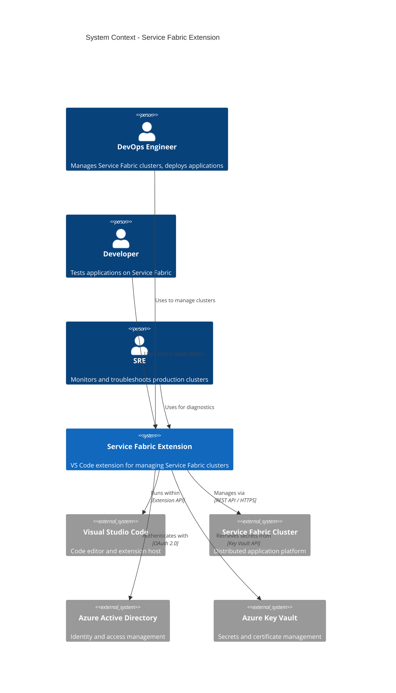

## C4 Model: Container Diagram

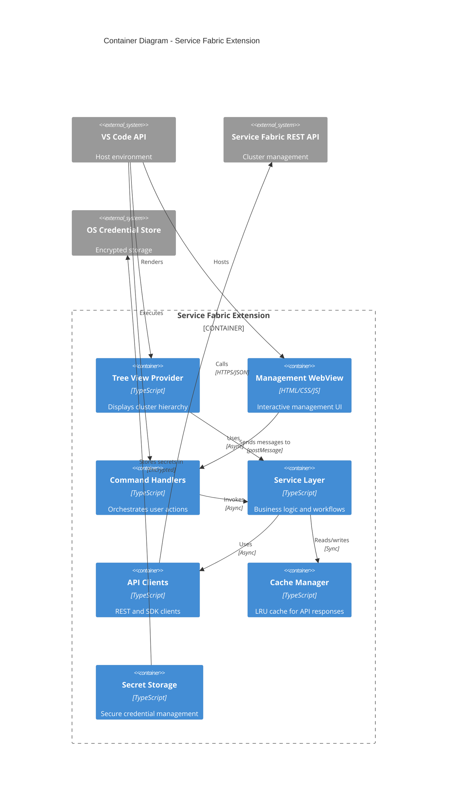

## C4 Model: Component Diagram (Service Layer)

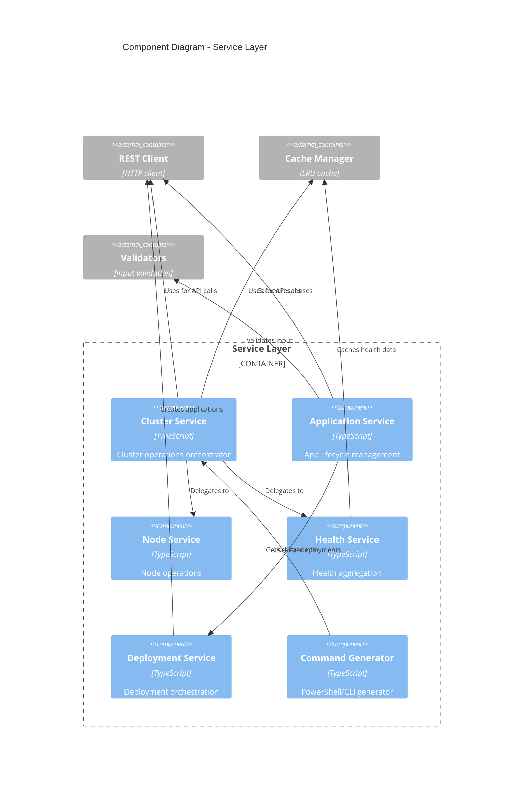

## Data Flow Architecture

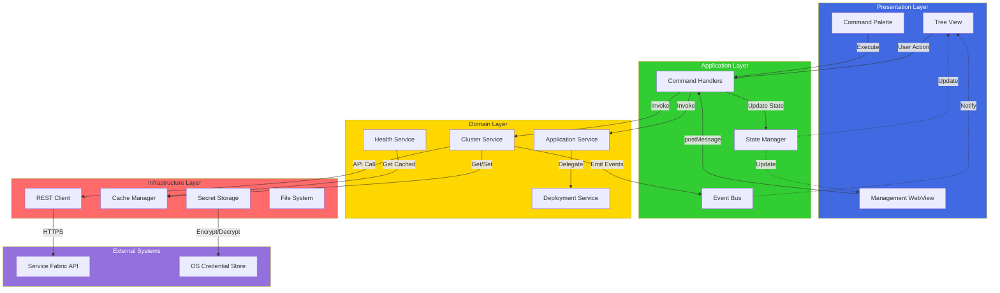

## Interaction: Cluster Connection Flow

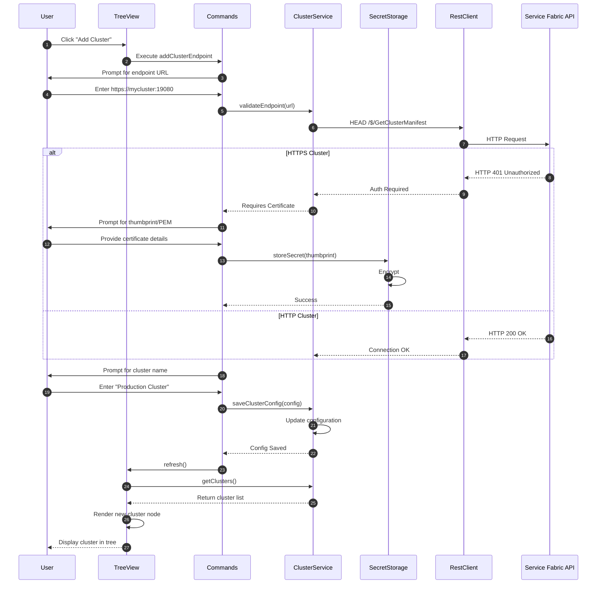

## Interaction: Application Deployment Flow

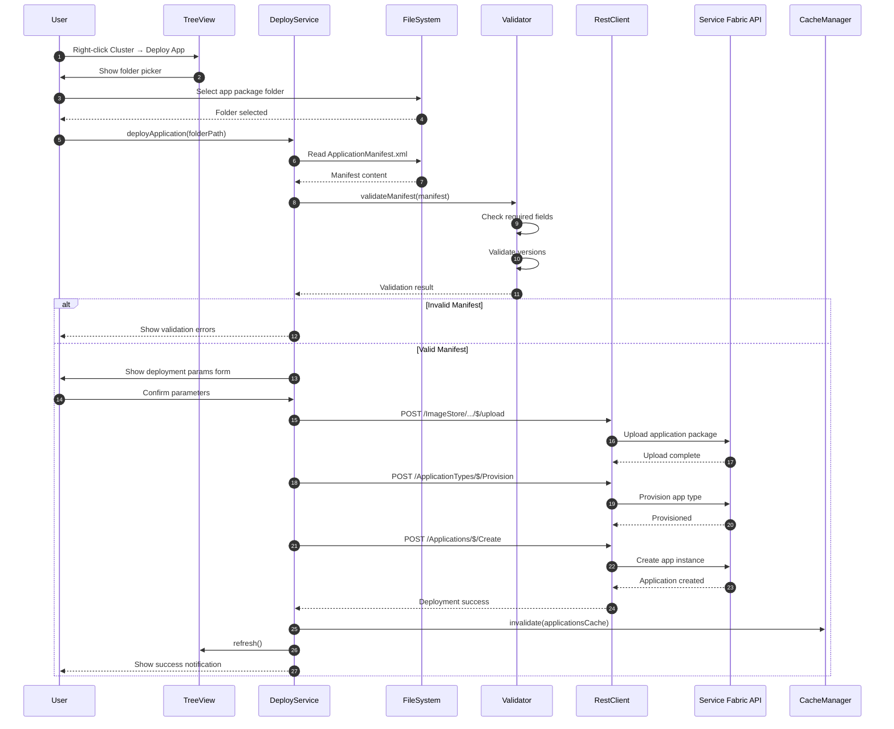

## Interaction: Tree View Loading with Caching

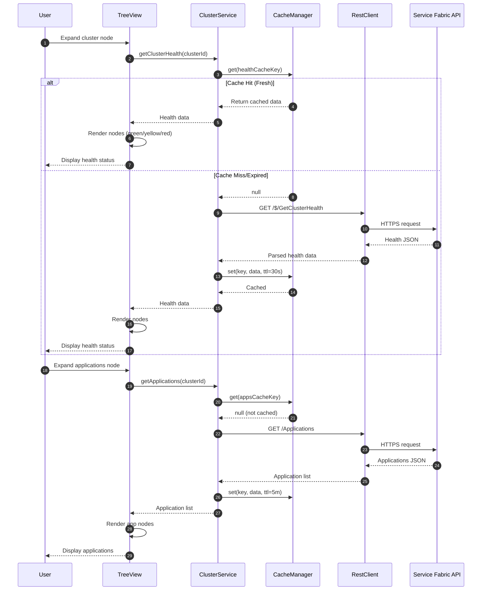

## State Management Architecture

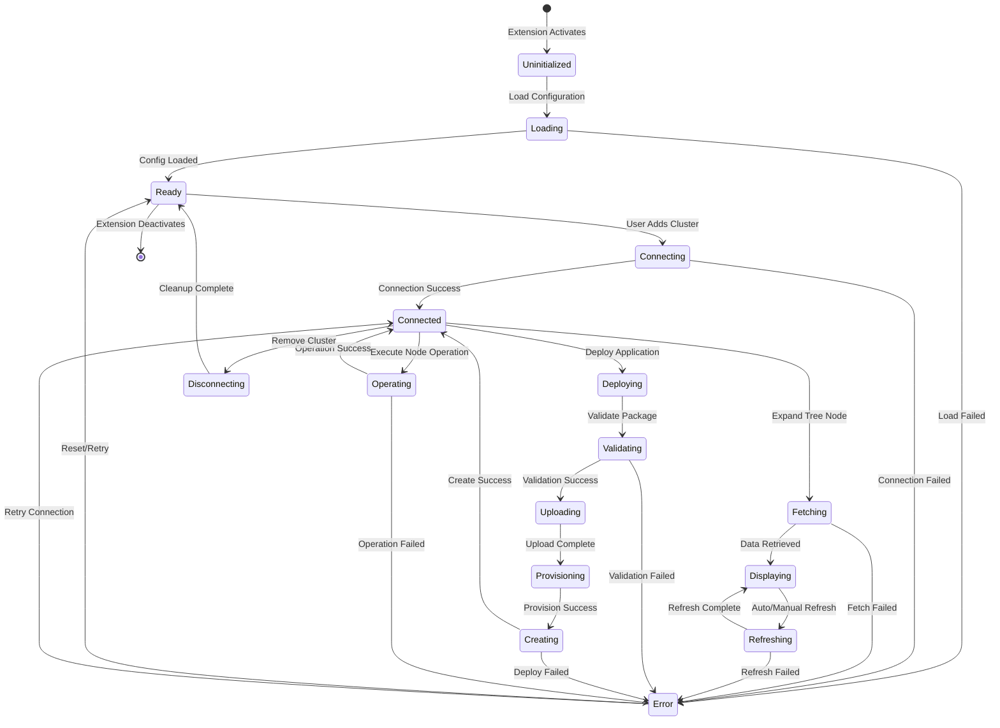

## Error Handling Flow

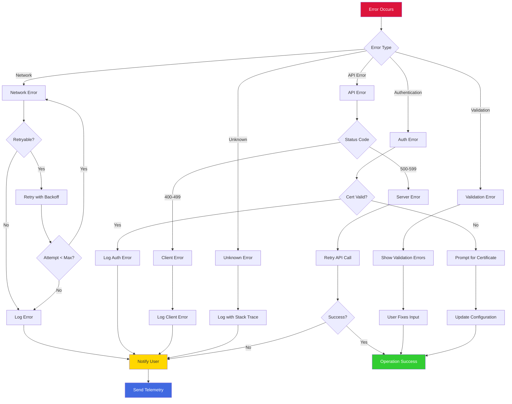

## Cache Strategy

```mermaid
flowchart LR
    subgraph CachePolicy["Cache Policy"]
        direction TB
        P1[Cluster Health: 30s TTL]
        P2[Cluster Manifest: 5m TTL]
        P3[Application List: 5m TTL]
        P4[Node List: 1m TTL]
        P5[Service List: 2m TTL]
        P6[Partition/Replica: 1m TTL]
    end
    
    subgraph Invalidation["Cache Invalidation"]
        direction TB
        I1[Write Operations → Invalidate]
        I2[Manual Refresh → Clear]
        I3[TTL Expiry → Remove]
        I4[Memory Limit → LRU Evict]
    end
    
    subgraph Storage["Cache Storage"]
        direction TB
        S1[In-Memory Map]
        S2[Max Size: 100 MB]
        S3[LRU Eviction]
        S4[Entry: key, value, ttl, timestamp]
    end
    
    CachePolicy --> API[API Request]
    API --> Check{Cache Hit?}
    
    Check -->|Yes + Fresh| Return[Return Cached]
    Check -->|Yes + Stale| Remove[Remove Entry]
    Check -->|No| Fetch[Fetch from API]
    
    Remove --> Fetch
    Fetch --> Store[Store in Cache]
    Store --> Storage
    
    Invalidation -.->|Triggers| Remove
    Storage -.->|Enforces| Invalidation
    
    style CachePolicy fill:#4169E1,color:#fff
    style Invalidation fill:#FFD700
    style Storage fill:#32CD32,color:#fff
```

## Security Architecture

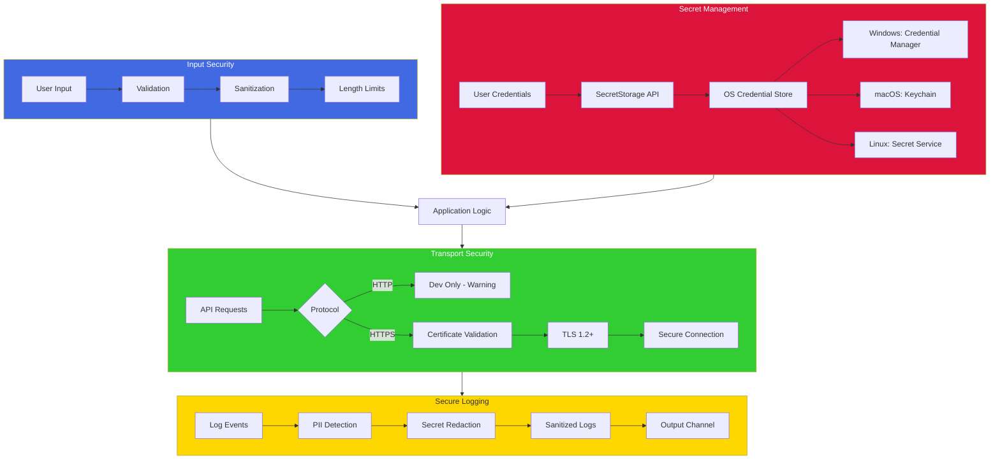

## Extension Lifecycle

## Performance Optimization Strategies

## Dependency Graph

See [ARCHITECTURE.md](ARCHITECTURE.md) for the complete module structure and dependencies.

## Testing Strategy Architecture

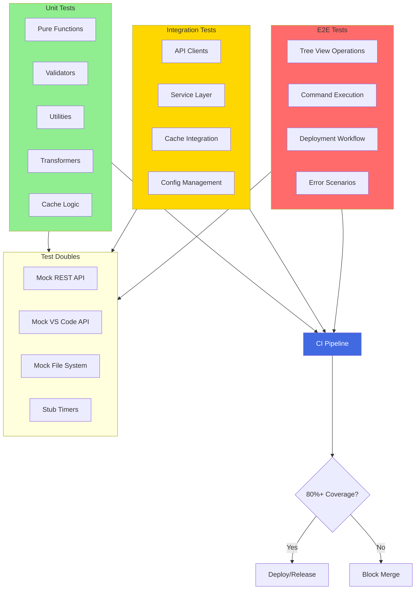

## Event-Driven Architecture

## Telemetry and Observability

## Module Interaction Matrix

| Module | TreeView | WebView | Commands | Services | RestClient | Cache | Secrets |
|--------|----------|---------|----------|----------|------------|-------|---------|
| **TreeView** | - | None | Event | Read | None | None | None |
| **WebView** | None | - | Message | Read | None | None | None |
| **Commands** | Update | Update | - | Read/Write | None | None | Read |
| **Services** | Notify | Notify | Return | - | Call | Read/Write | Read |
| **RestClient** | None | None | None | Return | - | None | Read |
| **Cache** | None | None | None | Return | None | - | None |
| **Secrets** | None | None | Return | Return | Config | None | - |

**Legend:**
- **Read**: Reads data without modification
- **Write**: Modifies state
- **Call**: Invokes methods
- **Return**: Returns data
- **Update**: Triggers UI update
- **Notify**: Sends event notification
- **Message**: Posts message
- **Event**: Fires event
- **Config**: Provides configuration
- **None**: No direct interaction

---

*This document provides behavioral and logical views of the architecture. For physical structure and code organization, see [ARCHITECTURE.md](ARCHITECTURE.md).*
