# Service Fabric Application CRUD Lifecycle

This diagram documents the full application lifecycle management architecture for the VSCode Service Fabric Diagnostic Extension, covering Create, Read, Update, and Delete operations with their SF REST API endpoints, PowerShell cmdlets, health policies, version constraints, and error handling.

> **Note:** The UPDATE (Rolling Upgrade) section is documented for future implementation — the extension currently has stubs for upgrade commands.

```mermaid
---
title: "Service Fabric Application CRUD Lifecycle — VSCode Extension Architecture"
config:
  theme: dark
  layout: elk
  elk:
    mergeEdges: true
    nodePlacementStrategy: NETWORK_SIMPLEX
---
%%{init: {'theme': 'dark'}}%%
flowchart TD
    %% ═══════════════════════════════════════════════════════════
    %% ENTRY → ROUTER → CRUD sections (linear flow, no crossings)
    %% ═══════════════════════════════════════════════════════════

    subgraph ENTRY["👤 User Entry Points"]
        direction LR
        CMD["Command Palette\nservice fabric: *"]
        TREE["Tree View Context\nRight-click Actions"]
        WEB["Management Webview\nDeploy / Upgrade / Remove"]
    end

    ENTRY --> ROUTER{"Select Operation"}

    subgraph AUTH["🌐 Cluster & Auth"]
        direction LR
        CLUSTERS["sfClusterExplorer.clusters\nMultiple endpoints"]
        ACTIVE["Active Cluster Selection\nPersisted across sessions"]
        CERTS["Certificate Auth\nThumbprint in settings\nPEM in SecretStorage\nAzure AD / Windows"]
        CLUSTERS --> ACTIVE --> CERTS
    end

    ROUTER --> AUTH
    AUTH --> OP_CHOICE{"CRUD Operation"}

    OP_CHOICE -->|"CREATE"| CREATE
    OP_CHOICE -->|"READ"| READ
    OP_CHOICE -->|"UPDATE"| UPDATE
    OP_CHOICE -->|"DELETE"| DELETE

    %% ═══════════════════════════════════════════════════════════
    %% CREATE
    %% ═══════════════════════════════════════════════════════════

    subgraph CREATE["📦 CREATE — Deploy New Application"]
        direction TB

        subgraph BUILD["Phase 0 — Build & Package"]
            direction TB
            DISCOVER["Discover Projects\nScan .sfproj\nParse manifests"]
            B_CHOICE{"Build Method?"}
            MSB["MSBuild /t:Package"]
            DOT["dotnet build"]
            VALIDATE["Validate Package\nManifest checks\nCode/Config/Data present"]
            PKG["Package Path\npkg/Debug or Release"]

            DISCOVER --> B_CHOICE
            B_CHOICE -->|"msbuild"| MSB --> VALIDATE
            B_CHOICE -->|"dotnet"| DOT --> VALIDATE
            VALIDATE --> PKG
        end

        D_CHOICE{"Deploy Method?"}

        subgraph REST_C["REST API — 3-Step"]
            direction TB
            R1["1. Upload to ImageStore\nPUT /ImageStore/path\napi-version=6.0"]
            R2["2. Provision Type\nPOST /AppTypes/$/Provision\napi-version=6.2"]
            R3["3. Create Instance\nPOST /Applications/$/Create\napi-version=6.0"]
            R_OK["✅ App Running"]

            R1 -->|"success"| R2
            R2 -->|"Available"| R3
            R3 -->|"201"| R_OK
        end

        subgraph PS_C["PowerShell SDK"]
            direction TB
            P1["Connect-SFCluster\nCert / AD auth"]
            P2["Copy-SFAppPackage\n-CompressPackage"]
            P3["Register-SFAppType\n-Async"]
            P4["New-SFApplication\nfabric:/Name"]
            P5["Remove-SFAppPackage\nClean ImageStore"]

            P1 --> P2 --> P3 --> P4 --> P5
        end

        PKG --> D_CHOICE
        D_CHOICE -->|"REST"| REST_C
        D_CHOICE -->|"PowerShell"| PS_C
    end

    %% ═══════════════════════════════════════════════════════════
    %% READ
    %% ═══════════════════════════════════════════════════════════

    subgraph READ["🔍 READ — Query & Monitor"]
        direction TB

        subgraph CLUSTER_Q["Cluster-Level Queries"]
            direction LR
            GA["GET /Applications"]
            GT["GET /ApplicationTypes"]
            GH["GET /Apps/id/$/GetHealth"]
            GM["GET /AppTypes/.../GetManifest"]
        end

        subgraph SVC_Q["Service Drill Down"]
            direction TB
            GS["GET .../GetServices\nStateful vs Stateless"]
            GP["GET .../GetPartitions\nScheme + status"]
            GR["GET .../GetReplicas\nRole + state + node"]
            GD["GET /Nodes/.../GetApplications\nDeployed per node"]

            GS --> GP --> GR
        end

        subgraph EVT_Q["EventStore — api-version=6.4"]
            direction LR
            CE["Cluster Events"]
            AE["Application Events"]
            SE["Service Events"]
        end

        subgraph HEALTH["Health States"]
            direction LR
            H_OK["🟢 OK"]
            H_W["🟡 Warning"]
            H_E["🔴 Error"]
        end

        GA --> GS
        GH --> HEALTH
    end

    %% ═══════════════════════════════════════════════════════════
    %% UPDATE
    %% ═══════════════════════════════════════════════════════════

    subgraph UPDATE["🔄 UPDATE — Rolling Upgrade ⚠️ Future"]
        direction TB

        subgraph UPG_PREP["Preparation"]
            direction TB
            NV["New Package\nIncremented version"]
            UL["Upload\nPUT /ImageStore/new"]
            PV["Provision New Version\nVersions coexist"]
            NV --> UL --> PV
        end

        subgraph UPG_EXEC["Execution"]
            direction TB
            SU["POST .../Upgrade\nUpgradeKind=Rolling"]
            UM{"Upgrade Mode?"}
            MON["Monitored\nAuto UD progression\nHealth checks\nAuto-rollback"]
            UAU["UnmonitoredAuto\nNo health checks"]
            UMA["UnmonitoredManual\nManual MoveNext"]

            SU --> UM
            UM -->|"Monitored"| MON
            UM -->|"Auto"| UAU
            UM -->|"Manual"| UMA
        end

        subgraph UPG_HEALTH["Health Policy per UD"]
            direction TB
            HCW["WaitDuration\nCooldown"]
            HCS["StableDuration\nMust stay healthy"]
            HCR["RetryTimeout\nMax retry"]
            FA{"FailureAction?"}
            RB["🔙 Rollback"]
            MI["⏸️ Manual Intervene"]

            HCW --> HCS
            HCS -->|"healthy"| NUD["✅ Next UD"]
            HCS -->|"unhealthy"| HCR
            HCR -->|"timeout"| FA
            FA -->|"Rollback"| RB
            FA -->|"Manual"| MI
        end

        subgraph UPG_MON["Progress Monitor"]
            direction LR
            GPR["GET .../GetUpgradeProgress"]
            UPR["POST update params"]
            RBC["POST .../RollbackUpgrade"]
        end

        PV --> SU
        MON --> HCW
    end

    %% ═══════════════════════════════════════════════════════════
    %% DELETE
    %% ═══════════════════════════════════════════════════════════

    subgraph DELETE["🗑️ DELETE — Removal Pipeline"]
        direction TB

        subgraph DEL_WARN["⚠️ Safety Rules"]
            direction LR
            W1["Cannot unprovision\nif instances exist"]
            W2["Cannot delete app\nif upgrading"]
            W3["Deletes ALL services\n+ state IRREVERSIBLE"]
        end

        subgraph DEL_STEPS["Ordered Deletion"]
            direction TB
            DR["Delete Replica\nStateless: kill\nStateful: rebuild"]
            DS["Delete Service\nDELETE /Services/id\nAll partitions removed"]
            DA["Delete Application\nDELETE /Applications/id\nCascades everything"]

            DR --> DS --> DA
        end

        subgraph CLEANUP["Unprovision & Cleanup"]
            direction TB
            UT["Unprovision Type\nPOST .../Unprovision"]
            CI["Clean ImageStore\nDELETE /ImageStore/path"]
            VC["Verify\nNo orphan types\nNo stale packages"]

            DA -->|"all deleted"| UT --> CI --> VC
        end
    end

    %% ═══════════════════════════════════════════════════════════
    %% CONSTRAINTS & ERRORS — reference sections (no crossing edges)
    %% ═══════════════════════════════════════════════════════════

    subgraph CONSTRAINTS["📋 Version & Safety Constraints"]
        direction LR
        C1["AppTypeName must\nmatch manifest"]
        C2["TypeVersion unique\nper provision"]
        C3["Name starts with\nfabric:/"]
        C4["Multiple instances\nfrom same type OK"]
        C5["Changed services need\nnew manifest version"]
        C6["Forward+backward\ncompat required"]
    end

    subgraph ERRORS["⚡ Error Handling"]
        direction LR
        E1["Upload Failure\nRetry with backoff"]
        E2["Provision Failure\nInvalid manifest\nVersion conflict"]
        E3["Create Failure\nResource/port\nconflicts"]
        E4["Upgrade Failure\nRollback or\nmanual fix"]
        E5["Orphan Cleanup\nAudit ImageStore"]
    end
```

## References

- [SF Application Lifecycle](https://learn.microsoft.com/en-us/azure/service-fabric/service-fabric-application-lifecycle)
- [Deploy and Remove Applications](https://learn.microsoft.com/en-us/azure/service-fabric/service-fabric-deploy-remove-applications)
- [Application Upgrade](https://learn.microsoft.com/en-us/azure/service-fabric/service-fabric-application-upgrade)
- [Upgrade Parameters](https://learn.microsoft.com/en-us/azure/service-fabric/service-fabric-application-upgrade-parameters)
- [Health Introduction](https://learn.microsoft.com/en-us/azure/service-fabric/service-fabric-health-introduction)
- [SF REST API Reference](https://learn.microsoft.com/en-us/rest/api/servicefabric/)
