# Service Fabric Application Deploy & Upgrade Phases

This document diagrams the lifecycle phases for deploying and upgrading Service Fabric applications through the extension's REST API path (`SfDeployService`).

## Deploy Flow (Fresh or Redeploy)

## Upgrade Flow (Rolling Upgrade)

```mermaid
flowchart TD
    START([Upgrade Initiated]) --> VALIDATE[Validate Package<br/>Check package path exists]
    VALIDATE -->|Missing| FAIL([❌ Error: Package not found])
    VALIDATE -->|OK| UPLOAD

    subgraph upgrade [Upgrade Phases]
        direction TB
        UPLOAD["📦 Phase 1: Upload New Package<br/>PUT files to Image Store<br/>Parallel (8 concurrent workers)<br/>Track: fileName (n/total)"]
        UPLOAD --> PROVISION["⚙️ Phase 2: Provision New Version<br/>POST RegisterApplicationType<br/>async=true"]
        PROVISION --> POLL["⏳ Phase 2b: Poll Provision<br/>GET ApplicationTypes<br/>until Status=Available"]
        POLL -->|Timeout| FAIL_PROV([❌ Provision Timeout])
        POLL -->|Available| CLEANUP["🧹 Phase 3: Cleanup Image Store<br/>DELETE image store content<br/>(non-fatal if fails)"]
        CLEANUP --> ROLLING["🔄 Phase 4: Start Rolling Upgrade<br/>POST StartApplicationUpgrade<br/>mode=Monitored, failureAction=Rollback"]
    end

    ROLLING --> MONITOR([✅ Upgrade Started<br/>Monitor in Cluster Explorer])

    style FAIL fill:#5a2727,color:#fff
    style FAIL_PROV fill:#5a2727,color:#fff
    style MONITOR fill:#2d5a27,color:#fff
```

## Remove Flow

```mermaid
flowchart TD
    START([Remove Initiated]) --> DELETE["🗑️ Phase 1: Delete Application<br/>POST DeleteApplication<br/>applicationId from fabric:/ name"]
    DELETE --> UNPROVISION["⚙️ Phase 2: Unprovision Type<br/>POST UnprovisionApplicationType<br/>typeName + typeVersion"]
    UNPROVISION --> SUCCESS([✅ Remove Complete])

    style SUCCESS fill:#2d5a27,color:#fff
```

## REST API Endpoints Used Per Phase

| Phase | Method | Endpoint | Description |
|-------|--------|----------|-------------|
| Pre-flight | GET | `/ApplicationTypes/{name}` | Check if type is provisioned |
| Pre-flight | GET | `/ApplicationTypes/{name}/$/GetApplicationManifest` | Get provisioned manifest XML |
| Pre-flight | GET | `/Applications` | Find running instances by type |
| Pre-flight | DELETE | `/Applications/{id}/$/Delete` | Delete instances (redeploy) |
| Upload | PUT | `/ImageStore/{path}` | Upload each file in package (parallel, 8 concurrent workers; matches native SF client pattern) |
| Upload | PUT | `/ImageStore/{dir}/_.dir` | Upload 0-byte directory marker files for `fabric:ImageStore` (service-based Image Store only) |
| Verify | GET | `/ImageStore/{path}` | Verify upload content |
| Provision | POST | `/ApplicationTypes/$/Provision` | Register application type (async) |
| Poll | GET | `/ApplicationTypes/{name}` | Poll until Status=Available |
| Create | POST | `/Applications/$/Create` | Create application instance |
| Upgrade | POST | `/Applications/{id}/$/Upgrade` | Start rolling upgrade |
| Cleanup | DELETE | `/ImageStore/{path}` | Remove package from image store |
| Remove | POST | `/Applications/{id}/$/Delete` | Delete application instance |
| Unprovision | POST | `/ApplicationTypes/{name}/$/Unprovision` | Unregister application type |

## PowerShell Deployment Path

The extension also supports deployment via SF PowerShell cmdlets. This path uses the same logical phases but through different commands. Notably, `Copy-ServiceFabricApplicationPackage` calls into the native `NativeImageStoreClient` which uploads ALL files in parallel via `ParallelUploadObjectsAsyncOperation`.

<!-- LIVE_DEPLOY_STATUS_START -->

## ✅ Live Remove Status

**MyAppType** v1.0.0 → `fabric:/MyAppType`  
Started: 14:09:05 | Elapsed: 9ms

| Phase | Status | Duration | Detail |
|-------|--------|----------|--------|
| Delete Application | ⏭️ skipped |  | Unprovision only |
| Unprovision Type | ✅ done | 3ms |  |

> Unprovisioned MyAppType:1.0.0

<!-- LIVE_DEPLOY_STATUS_END -->
