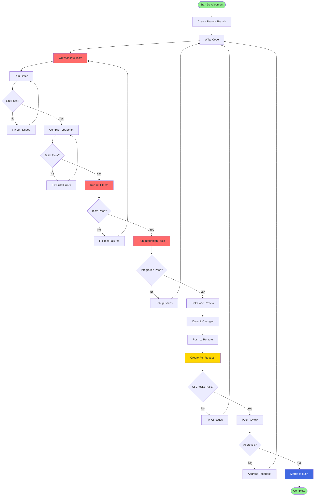
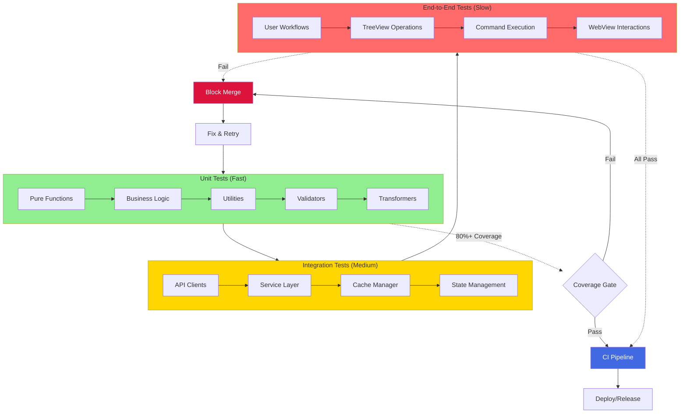
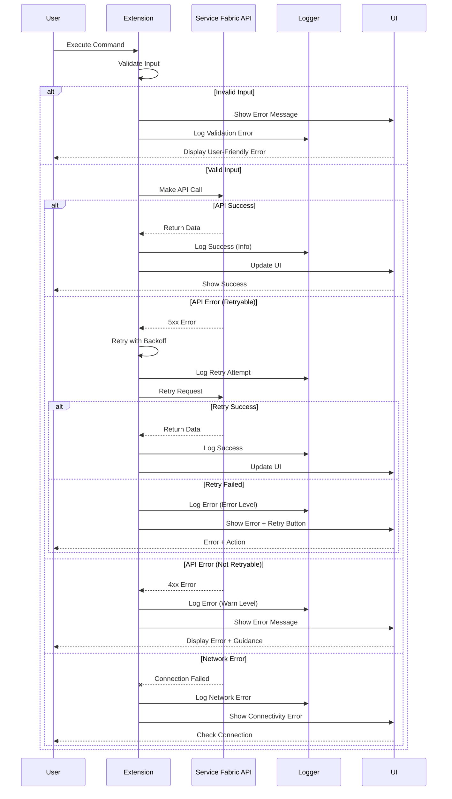

# Best Practices Guide

## Overview

This guide outlines development, security, testing, and operational best practices for the Service Fabric Diagnostic Extension.

## Development Workflow



## Code Quality Standards

## Security Best Practices

## Testing Strategy



## Performance Optimization

## Error Handling Patterns



## Branching Strategy

We follow a Git Flow branching model:
- **main**: Production-ready code
- **develop**: Integration branch for features
- **feature/***: New features and enhancements
- **hotfix/***: Emergency fixes for production

## Release Checklist

## Key Principles

### 1. **Security First**
- Never log sensitive data (secrets, PII, credentials)
- Use VS Code SecretStorage for credentials
- Validate and sanitize all user input
- Run security scans in CI/CD pipeline
- Keep dependencies up to date

### 2. **Performance Conscious**
- Cache API responses with appropriate TTL
- Use lazy loading for tree nodes
- Batch multiple API calls when possible
- Debounce/throttle high-frequency events
- Profile and optimize hot paths

### 3. **User Experience**
- Provide clear error messages with actionable guidance
- Show loading indicators for long operations
- Enable async operations with cancellation
- Preserve user context (tree expansion, selection)
- Support both mouse and keyboard navigation

### 4. **Maintainability**
- Write self-documenting code with clear names
- Add JSDoc comments for public APIs
- Keep functions small and focused (< 50 lines)
- Follow SOLID principles
- Refactor when adding third feature to similar code

### 5. **Testability**
- Write tests before or alongside implementation
- Mock external dependencies (API, file system, VS Code API)
- Test edge cases and error scenarios
- Maintain 80%+ code coverage
- Run tests locally before pushing

### 6. **Observability**
- Use structured logging with consistent levels
- Include correlation IDs for request tracing
- Log errors with full context (stack traces, request data)
- Sanitize logs to prevent PII leakage
- Use telemetry for usage analytics (anonymized)

## Code Review Checklist

- [ ] **Functionality**: Code works as intended and handles edge cases
- [ ] **Tests**: Adequate test coverage with passing tests
- [ ] **Security**: No secrets logged, input validated, dependencies updated
- [ ] **Performance**: No unnecessary loops, API calls, or blocking operations
- [ ] **Error Handling**: Proper try-catch blocks with meaningful error messages
- [ ] **Documentation**: JSDoc comments for public APIs, complex logic explained
- [ ] **Code Style**: Follows ESLint rules, consistent naming conventions
- [ ] **Dependencies**: New dependencies justified, licenses compatible
- [ ] **Breaking Changes**: Documented and versioned appropriately
- [ ] **Accessibility**: Keyboard navigation, screen reader support where applicable

## Common Anti-Patterns to Avoid

### ❌ Don't Do This

```typescript
// Logging secrets
console.log(`Certificate thumbprint: ${thumbprint}`);
SfUtility.outputLog(`Secret length: ${secret.length}`);

// Synchronous file operations
const data = fs.readFileSync(path);

// Unhandled promise rejections
api.getClusterHealth(endpoint); // No .catch() or try-catch

// Hardcoded values
const endpoint = 'https://mycluster.westus.cloudapp.azure.com:19080';

// Tight coupling
class TreeView {
    private api = new ServiceFabricRestClient(); // Direct instantiation
}
```

### ✅ Do This Instead

```typescript
// Sanitized logging
SfUtility.outputLog(`Certificate configured for cluster: ${clusterName}`);
SfUtility.outputLog(`Secret retrieved successfully`, debugLevel.debug);

// Async file operations
const data = await fs.promises.readFile(path);

// Proper error handling
try {
    await api.getClusterHealth(endpoint);
} catch (error) {
    SfUtility.outputLog(`Failed to get cluster health: ${error.message}`, debugLevel.error);
    vscode.window.showErrorMessage('Unable to retrieve cluster health. Please check connectivity.');
}

// Configuration-driven
const endpoint = vscode.workspace.getConfiguration('serviceFabric').get<string>('endpoint');

// Dependency injection
class TreeView {
    constructor(private api: IServiceFabricClient) {}
}
```

## CI/CD Pipeline Configuration

## Resource Limits

| Resource | Limit | Rationale |
|----------|-------|-----------|
| API Cache TTL | 30s - 5m | Balance freshness and performance |
| API Timeout | 30s | Prevent hanging requests |
| Max Retry Attempts | 3 | Avoid infinite loops |
| Concurrent API Calls | 5 | Rate limiting |
| Tree Node Children | 1000 | UI performance |
| Log File Size | 10 MB | Disk space management |
| WebView Memory | 100 MB | Browser performance |

## Support and Maintenance

- **Security Vulnerabilities**: Fix within 7 days, release patch version
- **Critical Bugs**: Fix within 14 days, release patch version
- **Feature Requests**: Triage weekly, implement in feature releases
- **Dependencies**: Update monthly, test thoroughly
- **VS Code API**: Upgrade engine within 30 days of new stable release
