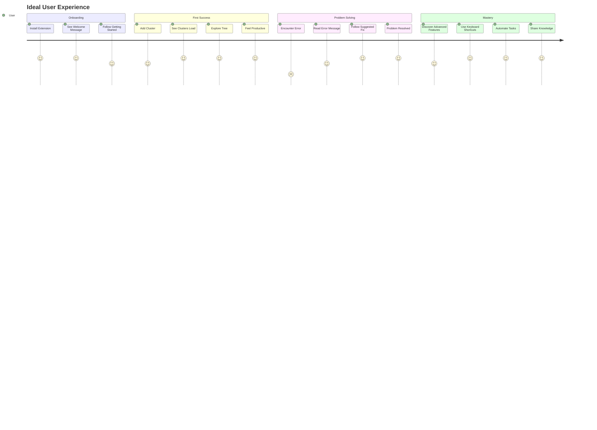
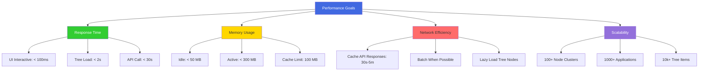
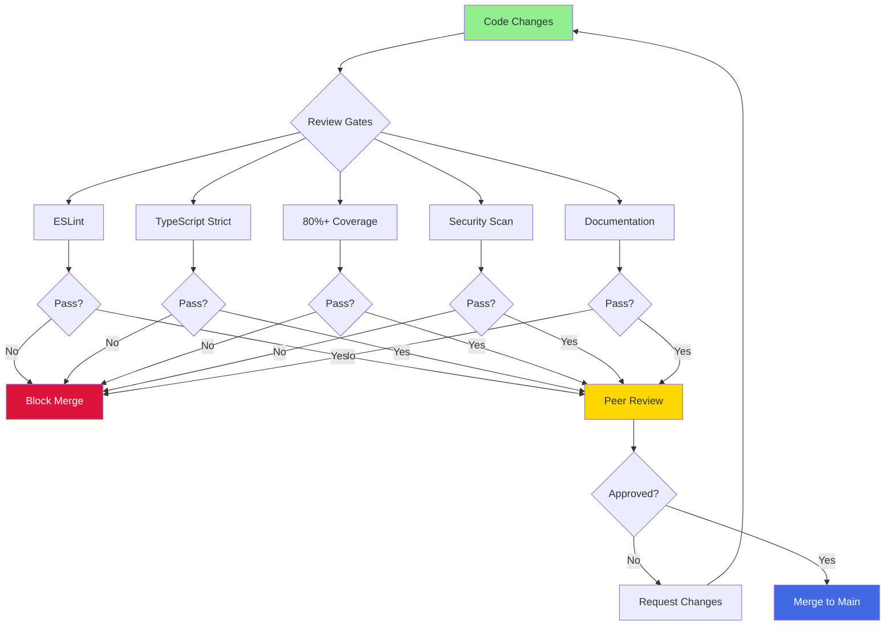
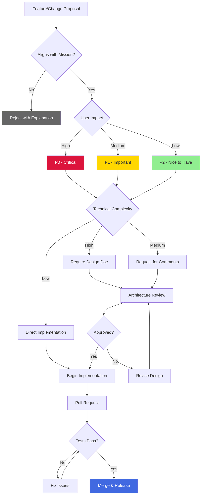
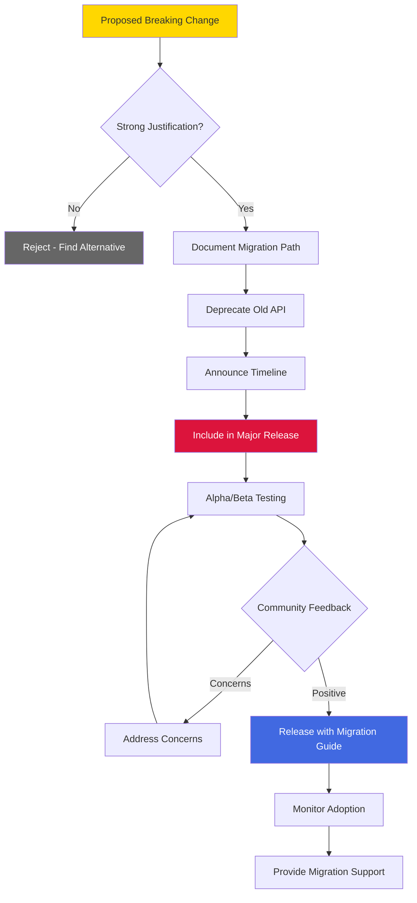

# Project Constitution

## Mission Statement

**Empower DevOps professionals and developers to efficiently manage Azure Service Fabric clusters through an intuitive, secure, and powerful VS Code extension that simplifies complex operations and accelerates troubleshooting.**

## Core Values

## Design Principles

### 1. Security by Design

```mermaid
flowchart LR
    subgraph Input["Input Layer"]
        I1[Validate]
        I2[Sanitize]
        I3[Rate Limit]
    end
    
    subgraph Storage["Storage Layer"]
        S1[Encrypt at Rest]
        S2[OS Credential Store]
        S3[No Plaintext]
    end
    
    subgraph Transport["Transport Layer"]
        T1[HTTPS Only]
        T2[Certificate Validation]
        T3[Timeout Enforcement]
    end
    
    subgraph Logging["Logging Layer"]
        L1[PII Obfuscation]
        L2[No Secret Logging]
        L3[Audit Trail]
    end
    
    Input --> Storage
    Storage --> Transport
    Transport --> Logging
    Logging --> Monitoring[Security Monitoring]
    
    style Input fill:#4169E1,color:#fff
    style Storage fill:#32CD32,color:#fff
    style Transport fill:#FFD700
    style Logging fill:#FF6B6B
    style Monitoring fill:#9370DB,color:#fff
```

**Commitments:**
- Never store secrets in plaintext
- Never log sensitive data (secrets, PII, credentials)
- Always validate and sanitize untrusted input
- Use HTTPS for production clusters
- Encrypt credentials using OS-level key stores
- Perform security audits before every release
- Fix critical vulnerabilities within 7 days

### 2. User-Centric Experience

**Commitments:**
- Optimize for most common workflows (80/20 rule)
- Provide clear, actionable error messages
- Include examples and documentation inline
- Support both mouse and keyboard navigation
- Preserve user context (tree expansion, selections)
- Show progress indicators for long operations
- Enable cancellation of in-progress operations

### 3. Performance Excellence

**Commitments:**
- Tree view loads in under 2 seconds
- UI remains responsive (< 100ms) during operations
- Extension memory usage stays under 300 MB
- Cache API responses appropriately (30s-5m TTL)
- Support clusters with 100+ nodes efficiently
- Lazy load tree nodes to minimize initial load
- Profile and optimize performance bottlenecks

### 4. Code Quality Standards

**Commitments:**
- Write tests before or alongside implementation
- Maintain 80%+ code coverage
- Use TypeScript strict mode
- Follow ESLint and Prettier rules
- Document public APIs with JSDoc
- Require peer review for all changes
- Keep functions small and focused (< 50 lines)

## Contribution Guidelines

### Decision-Making Framework

### Contribution Levels

## Code of Conduct

### Our Pledge

We pledge to make participation in our project a harassment-free experience for everyone, regardless of age, body size, disability, ethnicity, gender identity, experience level, nationality, personal appearance, race, religion, or sexual orientation.

### Standards

## Technical Governance

### Architecture Decision Records (ADR)

### Breaking Change Protocol

**Requirements:**
- Must provide clear migration path
- Must be in major version (semantic versioning)
- Must deprecate old API for at least 2 releases
- Must include migration guide in release notes
- Must provide tooling/scripts if possible

## Release Philosophy

### Semantic Versioning

### Release Cadence

- **Patch Releases**: As needed (bug fixes, security)
- **Minor Releases**: Every 6-8 weeks (new features)
- **Major Releases**: Annually (breaking changes)

### Support Policy

## Sustainability Commitments

## Communication Channels

| Channel | Purpose | Response Time |
|---------|---------|---------------|
| **GitHub Issues** | Bug reports, feature requests | 48 hours |
| **GitHub Discussions** | Questions, ideas, showcase | 72 hours |
| **Pull Requests** | Code contributions | 5 business days |
| **Security Email** | Vulnerability reports | 24 hours |
| **Discord** | Community chat, real-time help | Best effort |
| **Twitter/X** | Release announcements | N/A |

## Success Metrics

```mermaid
graph TB
    Success[Project Success] --> Quality
    Success --> Adoption
    Success --> Community
    Success --> Sustainability
    
    Quality --> Q1[< 5% Error Rate]
    Quality --> Q2[> 99% Crash-Free Sessions]
    Quality --> Q3[80%+ Test Coverage]
    Quality --> Q4[< 7 Day Security Fix]
    
    Adoption --> A1[1000+ Weekly Active Users]
    Adoption --> A2[4.0+ Marketplace Rating]
    Adoption --> A3[80%+ User Retention]
    Adoption --> A4[10+ Enterprise Adopters]
    
    Community --> C1[50+ Contributors]
    Community --> C2[10+ Regular Contributors]
    Community --> C3[5+ Maintainers]
    Community --> C4[< 48h Issue Response]
    
    Sustainability --> S1[Monthly Releases]
    Sustainability --> S2[Comprehensive Docs]
    Sustainability --> S3[Active Maintainers]
    Sustainability --> S4[Financial Stability]
    
    style Success fill:#FFD700,color:#000
    style Quality fill:#32CD32,color:#fff
    style Adoption fill:#4169E1,color:#fff
    style Community fill:#9370DB,color:#fff
    style Sustainability fill:#FF6B6B
```

## Amendment Process

This constitution is a living document. Amendments may be proposed by any contributor and require:

1. **Open Discussion**: Minimum 2 weeks for community feedback
2. **Core Team Vote**: 2/3 majority required for approval
3. **Documentation**: Clear rationale and impact assessment
4. **Communication**: Announcement to all contributors

## Final Word

This project exists to serve the community. Every decision should be evaluated through the lens of:

1. **Does this improve security?**
2. **Does this enhance user experience?**
3. **Does this maintain code quality?**
4. **Is this sustainable long-term?**

When in doubt, choose the option that best serves our users and aligns with our mission.

---

*Adopted: February 4, 2026*  
*Last Updated: February 4, 2026*  
*Version: 1.0.0*
