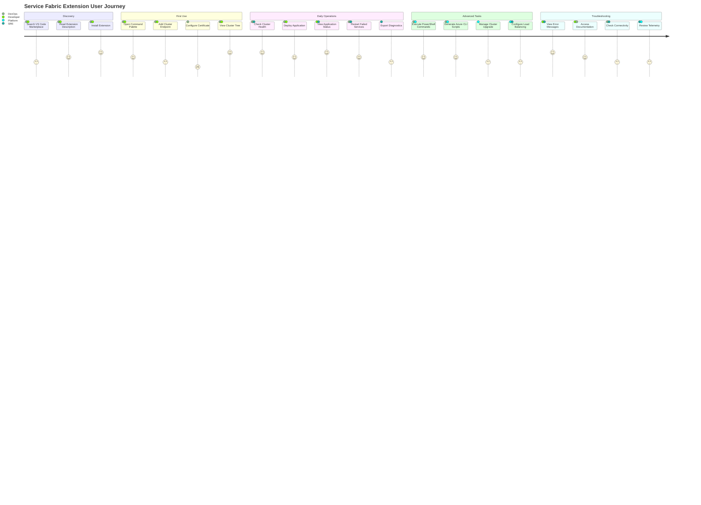
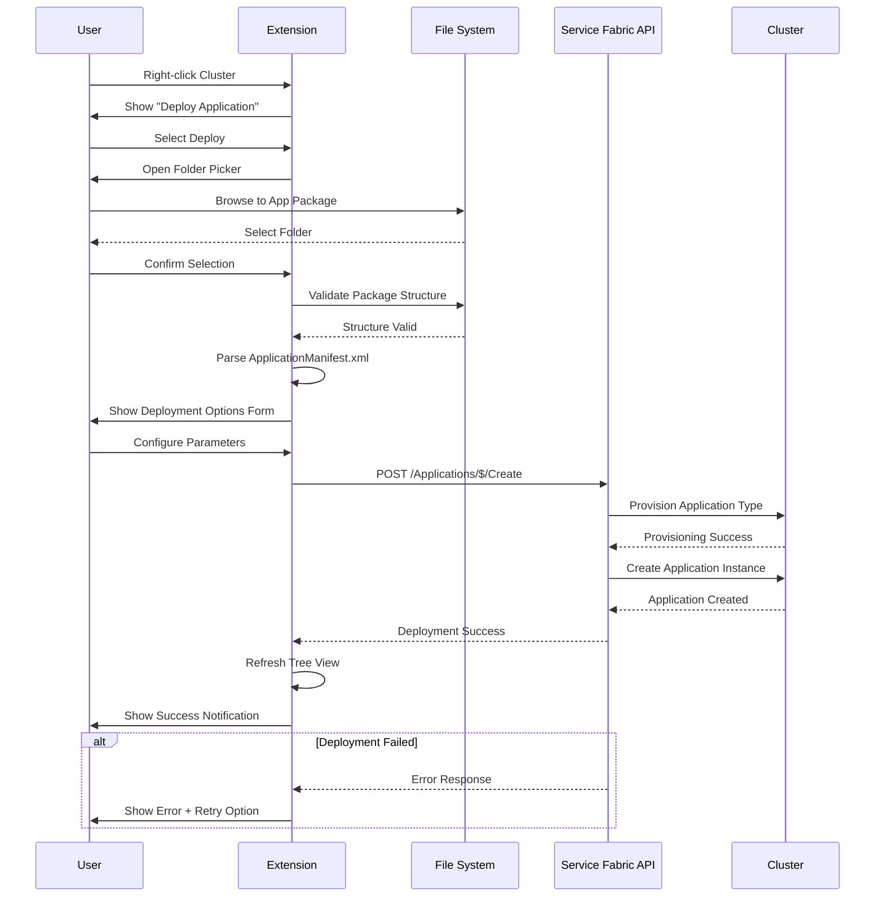
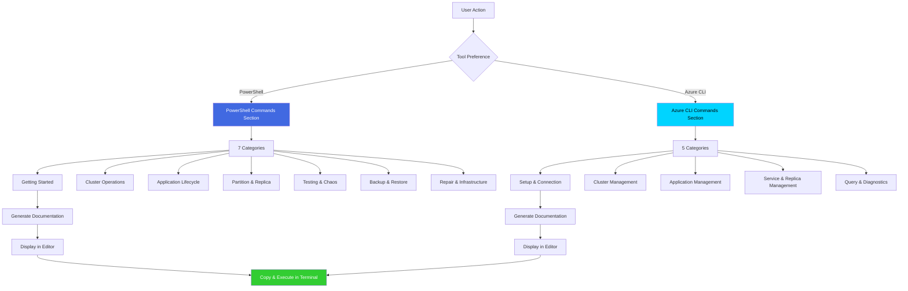
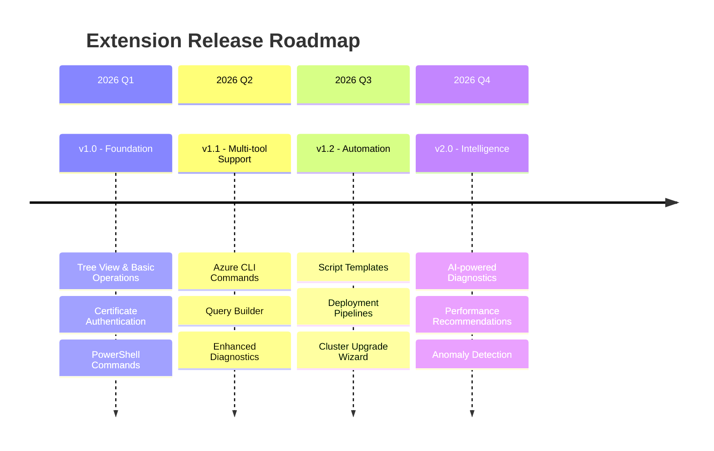
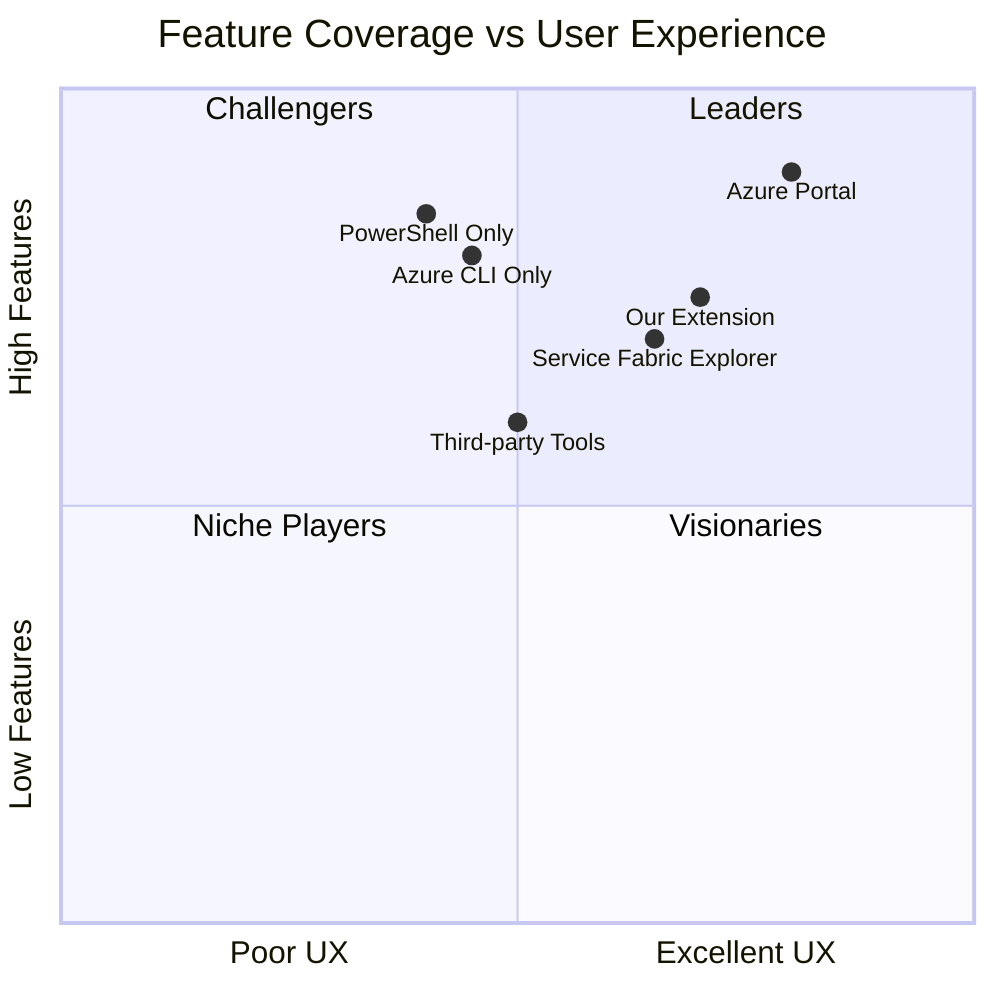

# Product Requirements Document (PRD)

## Product Vision

Build a **comprehensive VS Code extension** that simplifies Azure Service Fabric cluster management, diagnostics, and application lifecycle operations through an intuitive UI and powerful automation tools.

## Target Users

## User Journey Map

## Feature Breakdown

## Core Features

### 1. Cluster Explorer (Priority: P0)

**User Stories:**
- As a **DevOps engineer**, I want to view all clusters in a hierarchical tree so I can quickly navigate to specific nodes or applications
- As a **developer**, I want to see health status icons (green/yellow/red) so I can identify issues at a glance
- As an **SRE**, I want to refresh the tree view to see latest cluster state without reloading VS Code

**Acceptance Criteria:**
- [ ] Tree view displays clusters from configuration
- [ ] Nodes expand lazily (on-demand) for performance
- [ ] Health status icons update based on actual health state
- [ ] Right-click context menu provides relevant actions
- [ ] Refresh button updates entire tree or specific node
- [ ] Auto-refresh every 30 seconds (configurable)

### 2. Application Deployment (Priority: P0)

**User Stories:**
- As a **developer**, I want to deploy applications directly from VS Code so I don't need to switch to PowerShell or Azure Portal
- As a **DevOps engineer**, I want to configure deployment parameters before deployment so I can customize for different environments
- As an **SRE**, I want to see deployment progress and receive notifications so I know when it's complete

**Acceptance Criteria:**
- [ ] Browse and select application package folder
- [ ] Validate package structure (ApplicationManifest.xml required)
- [ ] Display deployment parameters form with defaults
- [ ] Show progress indicator during deployment
- [ ] Display success/failure notification
- [ ] Automatically refresh tree view after deployment
- [ ] Provide retry option on failure

### 3. PowerShell & Azure CLI Commands (Priority: P1)

**User Stories:**
- As a **platform engineer**, I want to see both PowerShell and Azure CLI options so I can use my preferred tooling
- As a **DevOps engineer**, I want generated commands to include my cluster-specific details so I can copy-paste without modification
- As a **developer learning Service Fabric**, I want comprehensive command documentation with examples so I can understand usage patterns

**Acceptance Criteria:**
- [ ] Side-by-side tool sections (PowerShell + Azure CLI)
- [ ] Commands organized into logical categories
- [ ] Generated documentation includes cluster endpoint and auth details
- [ ] Real-world examples with expected output
- [ ] Cross-platform compatibility notes
- [ ] Links to official documentation

### 4. Security & Authentication (Priority: P0)

**User Stories:**
- As a **security-conscious DevOps engineer**, I want certificates stored securely using OS credential stores so they're encrypted at rest
- As a **platform engineer**, I want the extension to never log secrets or sensitive data so I remain compliant with security policies
- As a **developer**, I want clear error messages when authentication fails so I can troubleshoot quickly

**Acceptance Criteria:**
- [ ] Support Windows Certificate Store (CurrentUser\My)
- [ ] Support PEM files for Linux/macOS
- [ ] Use VS Code SecretStorage API for credentials
- [ ] Never log secrets, thumbprints, or credential details
- [ ] Show security warning for unsecured HTTP connections
- [ ] Validate certificates before connection attempt
- [ ] Provide troubleshooting guidance for auth failures

## Non-Functional Requirements

## Success Metrics

## Release Roadmap

## Competitive Analysis

## Risk Assessment

| Risk | Impact | Probability | Mitigation |
|------|--------|-------------|------------|
| **Service Fabric API Changes** | High | Medium | Version compatibility matrix, CI testing against multiple SF versions |
| **VS Code API Breaking Changes** | High | Low | Target stable APIs only, test on Insiders build |
| **Certificate Management Complexity** | Medium | High | Comprehensive documentation, validation utilities, error messages |
| **Performance with Large Clusters** | Medium | Medium | Lazy loading, pagination, caching, virtual scrolling |
| **Security Vulnerability in Dependencies** | High | Low | Automated security scanning, weekly npm audit, rapid patch response |
| **User Adoption** | Medium | Medium | Clear value prop, excellent docs, active community support |
| **Platform-specific Issues** | Low | High | CI testing on Windows/macOS/Linux, platform-specific integration tests |

## Technical Constraints

## Open Questions

1. **Multi-cluster Operations**: Should users be able to perform operations across multiple clusters simultaneously (e.g., deploy same app to dev/test/prod)?

2. **Telemetry**: What level of anonymized usage telemetry should be collected? Opt-in or opt-out?

3. **Offline Mode**: Should the extension support offline mode with cached data, or always require live cluster connection?

4. **Custom Scripts**: Should there be a way for users to save and execute custom PowerShell/Azure CLI scripts from within the extension?

5. **Notification Preferences**: Should users be able to customize which events trigger notifications (deployments, health changes, etc.)?

## Dependencies

See [package.json](package.json) for the complete list of dependencies.

## Glossary

- **Service Fabric**: Microsoft's distributed systems platform for packaging, deploying, and managing microservices
- **SecretStorage API**: VS Code API for securely storing sensitive data using OS credential stores
- **TreeView**: VS Code UI component for displaying hierarchical data
- **WebView**: VS Code component for rendering custom HTML/CSS/JavaScript UI
- **PII Obfuscation**: Technique for hiding personally identifiable information in logs
- **Thumbprint**: SHA-1 hash of a certificate used as unique identifier
- **Partition**: Logical division of a Service Fabric service state for scalability
- **Replica**: Instance of a service partition running on a cluster node
